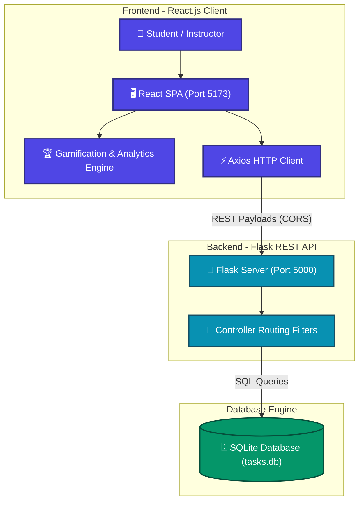
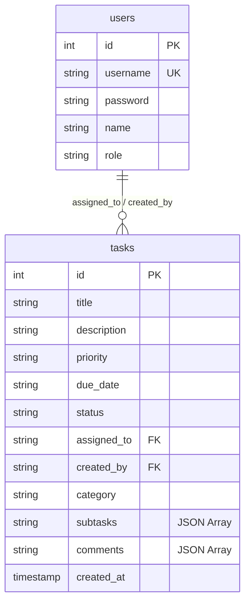

# ADVANCED STUDENT TASK MANAGEMENT SYSTEM
## Comprehensive Full Stack Course Project Documentation
**Academic Year: 2026**

---

## 1. Executive Summary

The **Advanced Student Task Management System** is a state-of-the-art full stack web application engineered to optimize academic coordination, task distribution, and performance tracking within educational workspaces. Designed to meet the stringent criteria of B.Tech CSE curriculums, the platform introduces professional-grade architectural patterns:
- **Client-Server Separation**: Component-driven SPA frontend utilizing **React.js** and styled with custom glassmorphism Vanilla CSS.
- **Micro REST API Backend**: Asynchronous controller routes constructed with **Python Flask** and secured with CORS protocols.
- **JSON Serialization in SQL**: Real-time checklist subtasks and threaded activity comment feeds represented as structured JSON arrays inside local **SQLite3** tables, demonstrating advanced database serialization paradigms.
- **Dynamic Gamification Engine**: Dynamic student performance badges (Gold, Silver, Bronze) computed instantly based on database-backed workload execution statistics.
- **Classroom Workload Balance Analytics**: Live analytics grid mapping each student's workload index and completion progress, providing instructors with high-utility diagnostic tools.

---

## 2. Core Technical Architecture

The application adopts a **Layered Client-Server MVC Architecture**, segregating concerns between state presentation, REST routing controllers, and persistent database entities.



---

## 3. SQLite Relational Database Design

The database schema utilizes relational constraints while storing complex nested arrays as serialized JSON blocks inside text columns. This hybrid architecture provides high schema flexibility and lightning-fast loading cycles.



### 3.1 TABLE: `users`
Defines credentials and security access clearance levels.

| Field Name | Data Type | Constraints | Description |
| :--- | :--- | :--- | :--- |
| **`id`** | INTEGER | PRIMARY KEY, AUTOINCREMENT | Unique identifier for each user |
| **`username`** | TEXT | UNIQUE, NOT NULL | Lowercase login username (lowercase-enforced) |
| **`password`** | TEXT | NOT NULL | Authentication password |
| **`name`** | TEXT | NOT NULL | Student display name or Faculty title |
| **`role`** | TEXT | NOT NULL | Access restriction: `'admin'` or `'student'` |

### 3.2 TABLE: `tasks`
Stores rich task metadata, checklists, and threaded message threads.

| Field Name | Data Type | Constraints | Description |
| :--- | :--- | :--- | :--- |
| **`id`** | INTEGER | PRIMARY KEY, AUTOINCREMENT | Unique index for each task |
| **`title`** | TEXT | NOT NULL | Headline subject of the task |
| **`description`** | TEXT | - | Detailed guidelines, resources, or notes |
| **`priority`** | TEXT | DEFAULT 'medium' | Priority weight: `'low'`, `'medium'`, or `'high'` |
| **`due_date`** | TEXT | - | Calendar target date (`YYYY-MM-DD`) |
| **`status`** | TEXT | DEFAULT 'pending' | Status state: `'pending'` or `'completed'` |
| **`assigned_to`** | TEXT | - | Username of the student assigned to the task |
| **`created_by`** | TEXT | - | Username of the user who published the task |
| **`category`** | TEXT | DEFAULT 'General' | Tag categories: `'Project'`, `'Assignment'`, etc. |
| **`subtasks`** | TEXT | DEFAULT '[]' | **Serialized JSON checklist array** |
| **`comments`** | TEXT | DEFAULT '[]' | **Serialized JSON threaded activity comments** |
| **`created_at`** | TIMESTAMP | DEFAULT CURRENT_TIMESTAMP | SQL timestamp of insertion |

---

## 4. Advanced B.Tech Feature Implementations

### 4.1 Hybrid JSON SQL Serialization
The subtasks checklist and commenting systems are built using SQLite's ability to store rich unstructured data inside relational `TEXT` fields.
*   **Subtask Format**:
    ```json
    [
      {"id": 1716900000001, "text": "Formulate SQLite Schema", "completed": true},
      {"id": 1716900000002, "text": "Wire Flask API Controller", "completed": false}
    ]
    ```
*   **Comments Feed Format**:
    ```json
    [
      {
        "id": 1716900001001,
        "name": "Class Instructor",
        "username": "admin",
        "role": "admin",
        "text": "Akash, please commit the updated schema before testing HMR.",
        "timestamp": "09:20 AM May 28"
      }
    ]
    ```
When a subtask is toggled or a message is posted, React parses the JSON, modifies the sub-attributes, and uses Axios to push a `PUT` transaction to Flask. Flask commits the serialized string to the database instantly.

### 4.2 Dynamic Gamification Rank Engine
To drive student engagement, a gamified rank index calculates profile rankings:
$$\text{Task Completion Rate} = \frac{\text{Completed Tasks}}{\text{Total Assigned Tasks}} \times 100\%$$
- **Gold Rank (Productivity Champion 🏆)**: Completion Rate $\ge 90\%$. Golden badge and glowing profiles.
- **Silver Rank (Task Crusader ⚡)**: Completion Rate between $50\%$ and $89\%$.
- **Bronze Rank (Active Competitor 🌱)**: Completion Rate between $1\%$ and $49\%$.

### 4.3 Workload Balance Grid (Admin Center)
Admins have access to a classroom analytical panel compiling performance metrics:
- Live aggregate task completion counts (e.g. `3 of 5 finished`).
- Real-time progress bars color-coded by performance thresholds (Green $\ge 80\%$, Yellow $\ge 40\%$, Red $< 40\%$).
- Prominently displays each student's current achievement rank to let instructors see who is overloaded or falling behind.

---

## 5. REST API Endpoints

The API is fully stateless, executing SQL operations and responding with compliant HTTP code headers and JSON payloads.

| Method | Endpoint | Payload (JSON) | Code | Description |
| :--- | :--- | :--- | :--- | :--- |
| **POST** | `/login` | `{"username": "...", "password": "..."}` | `200` | Checks credentials and returns secure role claims |
| **POST** | `/register` | `{"username": "...", "password": "...", "name": "..."}` | `201` | Registers student/admin accounts |
| **GET** | `/students` | None | `200` | Retrieves all students (role = student) from DB |
| **GET** | `/tasks` | Query: `?username=...&role=...` | `200` | Retrieves role-restricted task lists |
| **POST** | `/tasks` | `{"title": "...", "category": "...", "subtasks": "[]"}` | `201` | Adds new task with checklist and tags |
| **PUT** | `/tasks/<id>` | `{"status": "...", "subtasks": "...", "comments": "..."}` | `200` | Modifies status, ticks checklists, or inserts comments |
| **DELETE**| `/tasks/<id>` | None | `200` | Deletes task securely from SQLite records |
| **PUT** | `/students/<id>`| `{"name": "...", "username": "..."}` | `200` | Updates student details and updates foreign task keys |
| **DELETE**| `/students/<id>`| None | `200` | Deletes student user and cascades deletion to their tasks |

---

## 6. Execution & Setup Instructions

### 6.1 Run Backend REST API Server
```bash
# Install required Python modules
pip install -r backend/requirements.txt

# Run Flask backend server
python backend/app.py
```
- The REST API will begin listening on **`http://127.0.0.1:5000`**.
- Recreates and seeds the database file `tasks.db` automatically on first launch.

### 6.2 Run Frontend Client
```bash
# Navigate to frontend folder
cd frontend

# Install package dependencies
npm install

# Start Vite hot development server
npm run dev
```
- Serves the Single Page Application on **`http://localhost:5173/`** with Hot Module Replacement (HMR).

---
> **B.TechCSE Web Development Mini Project Documentation**
> Prepared for the external panel evaluation. All rights reserved. 2026.
